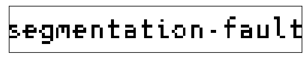

# tupper-py

## Introduction
Implements a class that plots [Tupper's self-referencing formula](https://en.wikipedia.org/wiki/Tupper%27s_self-referential_formula) at custom shifts, up and down the vertical axis. [There is a nice video by Matt Parker](https://www.youtube.com/watch?v=_s5RFgd59ao) explaining the formula.

## Example
First we instantiate the class:
```python
T = TupperPy()
```
Then we save the original Tupper's bitmap, by calling the `plot_tupper` method without arguments:
```python
T.plot_tupper()
plt.savefig(os.path.join("images", "tupper_classic.png"))
```
The result is shown below.


Now we use the k number for the "Sick" bmp from http://keelyhill.github.io/tuppers-formula/ , by shifting down along the y axis by the difference divided by the stantard height 17. Then, we save the result, i.e. :
```python
# "Sick" k from http://keelyhill.github.io/tuppers-formula/
k_sick = mp.mpf("19990658104895992159906328363638101787663851414537751539476865503218289618184076530123376594191"
                "24042366024039498437918666302237803582546013046303926310513280468110193127095922276315009796499"
                "31518795365589332244156816053373014059549452066117357397504861137579902513441094521287520230019"
                "51866779239406656151423658961709308717100436684082889189269813403152930991277247967173513256539"
                "22379772695517817049137311869862432577488386845165968713631941327344461868561513599475049479806"
                "55286675865714081044922472071253")

# Taking the difference divided by 17, and passing it to the method
k_diff = (T.k - k_sick) / 17

T.plot_tupper(-k_diff)
plt.savefig(os.path.join("images", "tupper_sick.png"))
```
The result is shown below.


And, finally, by using the image inversion in http://keelyhill.github.io/tuppers-formula/ one can find it's own number :). For me it is:
```
90148481231234420234256339826518908891180665991514386697053637829170729647072629523452184379509519968786531529157086222240846588818382686147528115820391410535922842107662943514026645644474464597472478128118156622623789731541015216164097940654139576824489045285519635874584835237199020948768154910493379733701018212522189039608339088660174287810933020618204779107609730139733444209152444083354067445681128839566703533349128277236144648362866511806158583554328798913388077254124644956335601331345966882979296712863250930395487098685789959131264
```
with the following result:



It is also possible to get the Tupper's number from a picture with the `bmp_to_number`, although the picture will be resized according to the height and width attributes (usually 106x17), and transformed to a 2 bit bitmap according to a nearest neighbour interpolation.

Have fun! :)
